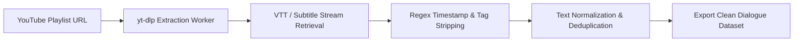

# YouTube Playlist Subtitle Scraper & NLP Preprocessor

An automated data extraction tool that uses `yt-dlp` to download, parse, clean, and structure multi-language subtitles from complete YouTube playlists into ready-to-use NLP datasets.

[](https://www.kaggle.com/code/lazer999/extracting-subtitles-from-youtube-playlists-vidz)
[](LICENSE)
[](https://www.python.org/downloads/)
[](#)

---

## Table of Contents
- [Project Overview](#project-overview)
- [Key Highlights & Results](#key-highlights--results)
- [System Architecture & Workflow](#system-architecture--workflow)
- [Repository Structure](#repository-structure)
- [Quickstart & Reproduction](#quickstart--reproduction)
- [Dataset Details](#dataset-details)
- [Author & Acknowledgments](#author--acknowledgments)

---

## Project Overview

This repository provides the complete, production-structured implementation of the **[YouTube Playlist Subtitle Scraper & NLP Preprocessor](https://www.kaggle.com/code/lazer999/extracting-subtitles-from-youtube-playlists-vidz)** project originally published on Kaggle. 

The primary focus of this work is translating complex data into actionable machine learning solutions using disciplined data engineering, rigorous validation strategies, and clean, leak-free preprocessing pipelines.

---

## Key Highlights & Results

- Batch downloads subtitles from entire YouTube playlists using `yt-dlp` with rate-limiting and retry protections.
- Robust WebVTT parsing: strips millisecond timestamps, speaker tags, and HTML styling artifacts.
- Multi-language support with automatic fallback to auto-generated subtitles when manual tracks are unavailable.
- Exports clean tabular datasets (CSV / DataFrame) with video metadata, episode indices, and processed dialogues.

---

## System Architecture & Workflow

The pipeline follows a structured, modular execution path:



---

## Repository Structure

```plaintext
youtube-subtitles-dataset-extractor/
├── notebooks/
│   └── youtube-subtitles-dataset-extractor.ipynb      # Original Jupyter notebook with full exploratory visuals
├── src/
│   └── main.py                # Modular, executable Python pipeline
├── .gitignore                 # Standard Python/Jupyter ignores
├── LICENSE                    # MIT License
├── README.md                  # Human-friendly documentation
└── requirements.txt           # Verified Python dependencies
```

---

## Quickstart & Reproduction

### 1. Clone the Repository
```bash
git clone https://github.com/musaoc/youtube-subtitles-dataset-extractor.git
cd youtube-subtitles-dataset-extractor
```

### 2. Set Up a Virtual Environment
```bash
# Linux / macOS
python3 -m venv venv
source venv/bin/activate

# Windows
python -m venv venv
.\venv\Scripts\activate
```

### 3. Install Dependencies
```bash
pip install --upgrade pip
pip install -r requirements.txt
```

### 4. Run the Pipeline
You can run the end-to-end script directly:
```bash
python src/main.py
```

Or open and run the interactive notebook:
```bash
jupyter lab notebooks/youtube-subtitles-dataset-extractor.ipynb
```

---

## Dataset Details

- **Dataset / Competition**: [Urdu-English Drama Dialogue Corpus](https://www.kaggle.com/datasets/lazer999/urdu-english-pakistani-dramas-dialogue-corpus)
- **Origin Platform**: Kaggle
- For automated dataset downloading via Kaggle CLI:
  ```bash
  kaggle datasets download -d lazer999/urdu-english-pakistani-dramas-dialogue-corpus
  ```

---

## Author & Acknowledgments

- **Author**: **Muhammad Musa Khan** (Kaggle Master)
- **Kaggle Profile**: [@lazer999](https://www.kaggle.com/lazer999)
- **GitHub**: [@musaoc](https://github.com/musaoc)
- **Original Kaggle Solution**: [YouTube Playlist Subtitle Scraper & NLP Preprocessor](https://www.kaggle.com/code/lazer999/extracting-subtitles-from-youtube-playlists-vidz)

If you found this project helpful or insightful, please consider starring the repository ⭐!
